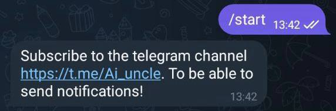
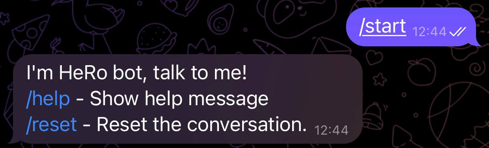
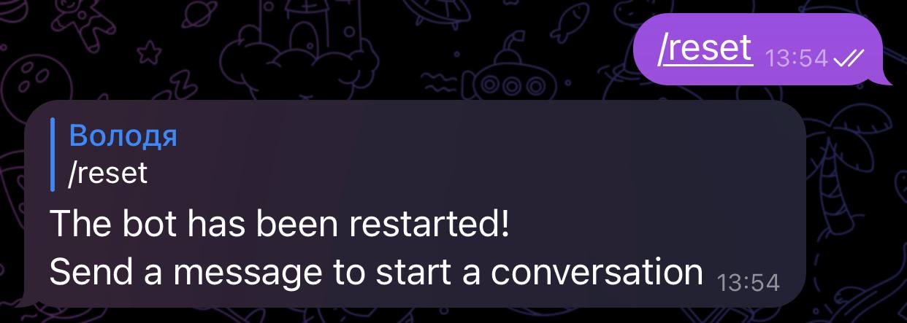
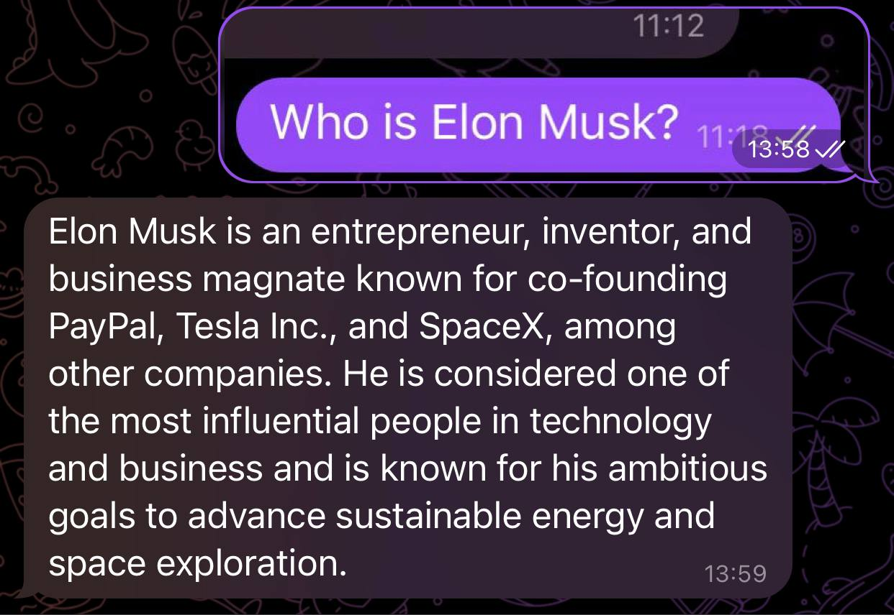
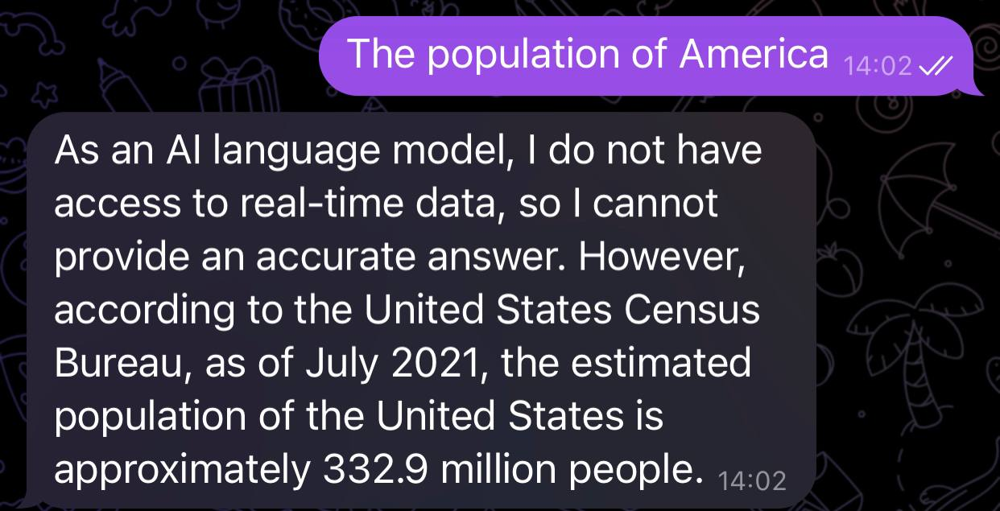
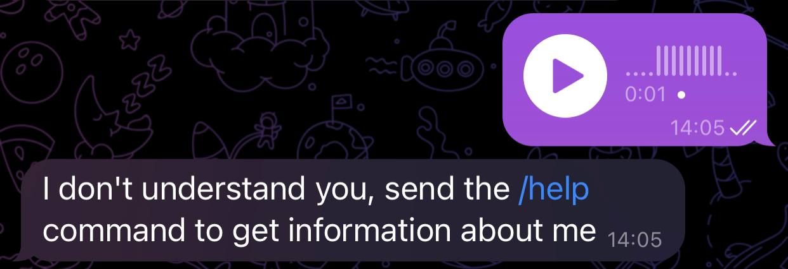

# Telegram bot based on GPT3.5 turbo

---

## Description of interaction with the bot
1. The user sends the /start command to the bot (or starts it by searching for it):
    1. Бот проверяет, подписан ли пользователь на телеграм-канал по ID канала (ID канала можно изменить в файле .env в переменной CHAT_ID):
        * If the user is not subscribed, the bot prompts the user to subscribe to the channel 
        
        * If the user is subscribed, the bot greets the user, informs him that he can talk to AI, and shows him a list of available commands.
        
    
2. At this stage the user can perform 5 actions:
   1. Send a chat command /help or /help.
   2. Send the command /reset to chat
   3. Send a photo to the chat room
   4. Send a text message to the chat 
   5. Send any other message to the chat (video, audio, document, file...)
3. The user sends a chat command /help or /start:
    * the bot greets the user, informs him that he can talk to AI, and shows him a list of available commands.
    
4. The user sends a chat command /reset:
    * The bot restarts the bot session
    
5.  The user send a photo to the chat room:
    * The text from the photo is read and gpt gives an answer to this text
    
6. The user send a text message to the chat:
    * The gpt model sends a response to the text
    
7. The user send any other message to the chat (video, audio, document, file...):
    * The bot replies that it does not understand the user and asks to send the /help command
    

---

## Structure of gpt-telgram-bot

* bot_gpt - root directory of the entire project
    * bot.py - The main executable file - the entry point to the bot
    * .env.example - A file with sample secrets for GitHub
    * .gitignore - file that tells the git which files and directories not to track
    * README.md - File with instructions on how to use the bot
    * requirements.txt - File with libraries required for the bot to work
    * config.py - file with environment variables (secret data) for bot configuration
      * BOT_TOKEN - Replace with your own token from BotFather
      * API_KEY - Replace the gpt3.5 turbo api key from the openai website with your own 
      * CHAT_ID - Enter the chat ID that users must subscribe to before sending messages to the bot, the chat ID can be found in the bot https://t.me/username_to_id_bot by sending a link to your chat
      * TWS - Text animation writing speed, 0.1 high speed 0.9 slow
    * other_handlers.py - module with a handler for any user messages that are not caught by other handlers
    * user_handlers.py - module with user handlers. All basic bot update handlers will be in this module
    * lexicon.py - file with a dictionary of commands and requests that correspond to the displayed texts. That is, for example, if the user sent the command /start - he should get back some text. This text may change over time or depending on the user's language. It is convenient to store such correspondences in a separate file.
    * photo - This directory stores photos that the user sends to Telegram. And the photo is automatically deleted from here
    * photo_for_md - photo for README.md file
    * utils - directory with auxiliary tools for bot operation
